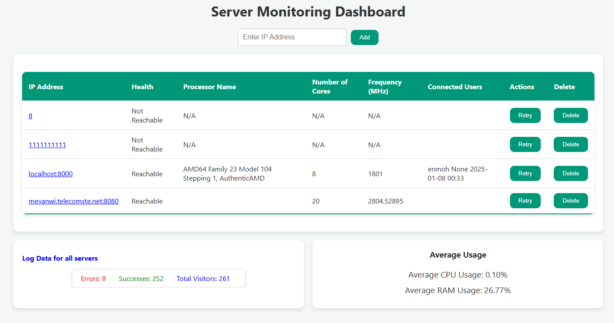
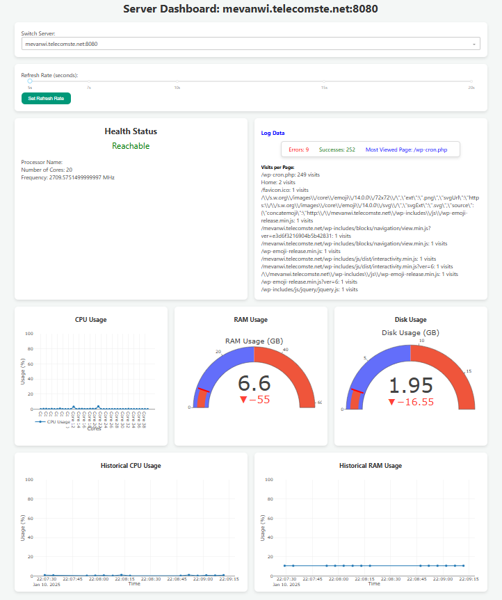
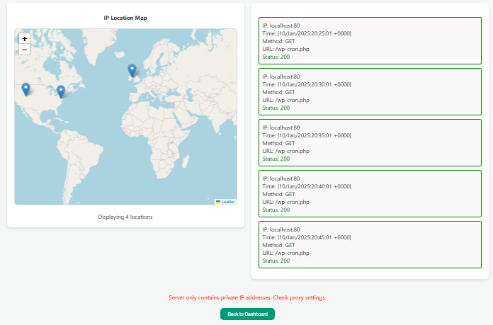

## Description

This project is to build a UI that will pull data from our agent's API. The dashboard updates automatically to display data evolving over time, giving the final user a good idea of the health of their servers at a glance.
To check the agent code visit [this link](https://github.com/rsmed31/Interface)

## Features

- **Real-time Monitoring**: Continuously updates to display the current health of servers.
- **CPU Usage Visualization**: Graphs showing real-time and historical CPU usage.
- **RAM Usage Visualization**: Graphs showing real-time and historical RAM usage.
- **Disk Usage Visualization**: Gauge displaying current disk usage.
- **Log Data Display**: Shows detailed log data for each server.
- **IP Geolocation Map**: Displays the geographical location of IP addresses.
- **Server Switching**: Easily switch between different servers for monitoring.
- **Customizable Refresh Rate**: Adjust the refresh rate for real-time data updates.
- **Error and Success Tracking**: Displays the number of errors and successful operations.
- **Connected Users**: Shows the list of users currently connected to the server.

## Technical Requirements

- Python 3.8+
- Docker (optional)
- Modern web browser
- Network access to agent API endpoints (check the agent project first)

## How to Use

### Pull and Run the Project using Docker

To pull the latest Docker image and run the project, use the following commands:

```sh
docker pull devops.telecomste.fr:5050/printerfaceadmin/2024-25/group1/printerfaceui:latest
docker run -p 8050:8050 devops.telecomste.fr:5050/printerfaceadmin/2024-25/group1/printerfaceui:latest
```

## Local Setup
### Clone the repository:

```sh
git clone https://devops.telecomste.fr/printerfaceadmin/2024-25/group1/printerfaceui.git
cd printerfaceui
```
### Install the requirements :
 
```sh
make environment
```

### Run the application :

```sh
make run
```

## Screenshots

### Main Dashboard

*Real-time monitoring of all added servers metrics*

### Resource Usage & Logs analysis


*CPU, RAM, and Disk usage visualization*

### Geographic View & Recent 5 logs
 

*IP Geolocation mapping of servers*


## CI/CD Pipeline

This project uses GitLab CI/CD for automated building.

View `.gitlab-ci.yml` for pipeline configuration.

## Project Hierarchy

- [components](https://devops.telecomste.fr/printerfaceadmin/2024-25/group1/printerfaceui/-/tree/main/src/components): Contains modular code responsible for generating the visual elements of the dashboard application. Each module focuses on a specific system metric, handling data fetching and visualization.
- [layouts](https://devops.telecomste.fr/printerfaceadmin/2024-25/group1/printerfaceui/-/tree/main/src/layouts): Different pages frontend code.
- [assets](https://devops.telecomste.fr/printerfaceadmin/2024-25/group1/printerfaceui/-/tree/main/src/assets): General files to use for display (styling, images, etc.).
- [services](https://devops.telecomste.fr/printerfaceadmin/2024-25/group1/printerfaceui/-/tree/main/src/services): Code needed to communicate with the agent API and handle responses.
- [app.py](https://devops.telecomste.fr/printerfaceadmin/2024-25/group1/printerfaceui/-/blob/main/src/app.py): Main file that runs the project, contains callbacks, and main frontend code logic.

## Contributing

1. Fork the repository
2. Create a feature branch (`git checkout -b feature/amazing-feature`)
3. Commit changes (`git commit -m 'Add amazing feature'`)
4. Push to branch (`git push origin feature/amazing-feature`)
5. Open a Pull Request


